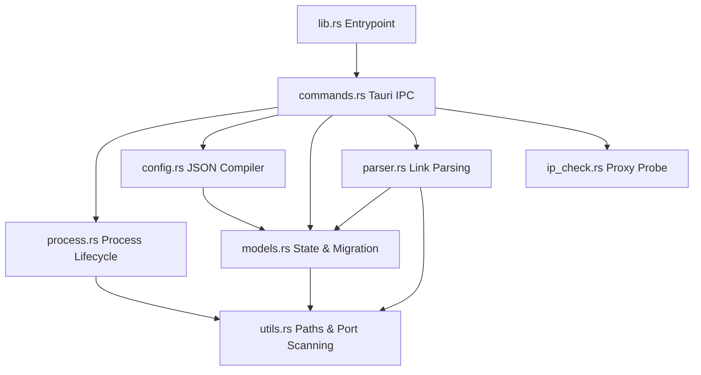

# xray-tools Project Notes & Architecture Guide

## Project Overview

`xray-tools` is a local portable desktop GUI built on Windows for managing a local Xray core. The app makes it easy to create multiple local proxy entry points (inbounds) for fingerprint browsers, so each browser profile can connect to a different local inbound port and exit through a different upstream proxy (outbound).

### Primary Product Goals
- **Core Process Lifecycle**: Control a local, user-provided Xray core binary (`xray.exe`): start, stop, restart, and track current running/restarting/stopped states.
- **Multi-Proxy Inbound Rules**: Create multiple local proxy rules dynamically. For each rule, the app provisions one inbound port, one matching outbound protocol configuration, and sets up a dedicated routing rule mapping the two.
- **Multiple Outbound Protocols**: Initially supports **SOCKS5**, **Shadowsocks**, and **VLESS** (TCP, TLS, and REALITY) outbounds, designed from day one to be easily extensible to others (e.g., VMess, Trojan) without rewriting persisted state.
- **Universal Clipboard Paste**: Parses and normalizes common browser and proxy-tool URLs directly into structured rule outbound configs.
- **Portable & Installer-Free**: Runs portably next-to-exe with local `./data/` and `./xray/` workspaces; does not require installation or system app data directories.

---

## 1. Project Directory Layout

The project follows a clean decoupled design dividing system-level Rust operations from UI-level React components:

```text
xray-tools/
├── data/                       # Created portably at runtime next to the executable
│   ├── app-state.json          # Persistent user application state (rules, paths)
│   └── generated-config.json   # Dynamically compiled Xray core run configuration
├── xray/                       # Folder where the user places the Xray core
│   ├── xray.exe                # Xray Windows executable binary
│   ├── geoip.dat
│   └── geosite.dat
├── src-tauri/                  # Desktop Shell (Tauri 2 + Rust)
│   ├── src/
│   │   ├── main.rs             # Native entry point (delegates to xray_tools_lib::run)
│   │   ├── lib.rs              # Library entry point, routing setup, & unit tests
│   │   ├── models.rs           # Persistent data schemas, validations & migrations
│   │   ├── utils.rs            # Port checks, path builders, and encoding utils
│   │   ├── process.rs          # Process controls (Xray child lifecycle)
│   │   ├── config.rs           # Xray JSON configuration compiler
│   │   ├── parser.rs           # SOCKS5/SS/VLESS URL paste parsers
│   │   ├── ip_check.rs         # Proxy-routed GeoIP checking
│   │   └── commands.rs         # Front-facing Tauri IPC Command routing layer
│   └── Cargo.toml
└── src/                        # UI Frontend (React 19 + TypeScript + Vite)
    ├── api/
    │   └── backend.ts          # Tauri invoke bindings for TS
    ├── features/
    │   └── runtime/            # Runtime layout blocks & status cards
    ├── App.tsx                 # Main Dashboard, editor modal, & control panel
    ├── App.css                 # Advanced, premium dark-glassmorphism CSS stylesheet
    └── main.tsx                # React app mount entrypoint
```

---

## 2. Rust Backend Modular Architecture

The Rust codebase is modularized to support robust scaling and zero compile warnings:



### Module Description & Responsibilities

#### A. Entrypoint & Test Harness (`lib.rs`)
- Exposes modular boundaries (`pub mod`).
- Re-exports key public structures (`AppState`, `Rule`, `InboundConfig`, `OutboundConfig`, etc.) so that external scopes and integration tests do not break.
- Declares the Tauri `run()` entrypoint, registering State handlers and embedding all 27+ system-level IPC command endpoints.
- Houses the 17 integration and unit tests validating URL parser edge cases, config compilers, port conflict detection, and migrations.

#### B. Domain models & Schema Migrations (`models.rs`)
- Represents the core structures, constants, and settings representing the application state.
- Employs a robust `OutboundConfig` enum capturing detailed protocols (`Socks`, `Shadowsocks`, `Vless`).
- Manages **Schema Version Migrations** (`SCHEMA_VERSION = 2`). Automatically migrates older legacy configurations (such as SOCKS-only structure V1) into the modular union format of V2.

#### C. Path & Port Utilities (`utils.rs`)
- Performs check bounds to locate `./data/` and `./xray/` next to the currently running executable (`std::env::current_exe`).
- Implements port binding tests: checks port availability via TCP listeners and returns boolean status flags.
- Prevents conflicts by checking overlapping ports before writing configurations.

#### D. Core Process Lifecycle (`process.rs`)
- Encapsulates state within `AppRuntimeState`, holding a `Mutex<XrayProcessManager>` and active atomic stats trackers.
- Manages child process creation: spawns `xray.exe -config generated-config.json` while managing stdout/stderr redirection.
- Safely terminates child processes on demand or during application exit (`tauri::RunEvent::Exit`).

#### E. Xray Config Compiler (`config.rs`)
- Compiles local rules into Xray JSON configurations.
- Translates each rule into:
  1. An `inbounds` entry (protocol: SOCKS or HTTP; listen address; port; authentication users).
  2. A corresponding `outbounds` entry mapping matching exit targets.
  3. A custom routing rule mapping the inbound tag to the outbound tag to enforce traffic separation.

#### F. universal Clipboard Parser (`parser.rs`)
- Decodes clipboard URLs into configuration models:
  - **SOCKS/SOCKS5**: `socks5://[user:pass@]host:port`
  - **Shadowsocks (ss)**: Supports standard formats, base64-encoded userinfo structures, and plugin-decorated setups.
  - **VLESS**: Parses parameters (`security`, `type`, `sni`, `fp`, `pbk`, `sid`, `flow`) to support standard TCP, TLS, and Reality protocols.

#### G. IP Route Checker (`ip_check.rs`)
- Executes network requests to `https://ipinfo.io/json` *through* the rule's specific local inbound port proxy to check route health, speed, and country details.

#### H. Tauri IPC Command API (`commands.rs`)
Exposes commands directly to React. Key API routes include:
- `load_app_state()` / `save_app_state(state: AppState)` / `save_and_apply_app_state(state: AppState)`
- `start_xray()` / `stop_xray()` / `restart_xray()`
- `check_rule_ip(rule: ProxyRule)` / `check_rules_ip_batch(rules: Vec<ProxyRule>)`
- `parse_outbound_url(url: String)` -> `CommandResult<ParseOutboundUrlResult>`
- `validate_xray_binary(path: String)` -> `CommandResult<bool>`
- `query_xray_stats()` -> `CommandResult<TrafficStats>`

---

## 3. Frontend Architecture & Design System

The React 19 interface implements a premium, high-tech glassmorphic aesthetic built purely on vanilla CSS variables:

### Styling & Aesthetics (`src/App.css`)
- **Theme Variables**: Curated harmonious colors tailored for high-contrast visibility (`--color-accent` cyan, `--color-accent-2` amber, and soft green/red indicators).
- **Glassmorphism panels**: Applies high-blur backdrops (`backdrop-filter: blur(1.25rem)`), subtle white border overlays, and custom grids overlaying radial gradient lighting.
- **Dynamic Animations**: Seamless micro-animations for card hovers, status dot glows, and toast message reveal steps.

### Entrypoints
- **`App.tsx`**: Renders the complete dashboard interface:
  - App state header (showing Xray status, active core path, and runtime system settings).
  - Port statistics grid.
  - Rules list, detailing active local listeners, connection routes, traffic statistics, and inline action controls.
  - Comprehensive Slide-Over editor modal for rule creation, port edits, custom inbound auth, and outbounds URL parsing.

---

## 4. Guidelines for Future AI Developers

When working on this repository, please adhere to the following strict practices:

### A. Extending Outbound Protocols
- Add the new protocol model to `models.rs` and register it inside the `OutboundConfig` enum.
- Implement matching URL parser routines inside `parser.rs` and add corresponding URL tests to `lib.rs` tests.
- Extend `config.rs` to generate the correct Xray JSON settings block for the new outbound protocol according to official Xray configuration specifications.

### B. Path Handling & Portability
- **Do not write absolute paths** or OS-dependent app data paths (`C:\Users\...` or `AppData`).
- Always resolve paths relative to the current executable directory via the systems provided in `utils.rs`.

### C. Package Manager
- Always use **`pnpm`** exclusively for frontend dependencies. Do not run `npm` or `yarn` commands which would create conflict lockfiles.

### D. Styling & CSS Rules
- Do not introduce ad-hoc utility styling packages unless required. Custom layout controls, themes, and animations must be handled within the curated variables of `src/App.css`.

### E. Code Integrity & Warnings
- Maintain strict type bounds. Avoid `as any` or suppression decorators (`@ts-ignore`).
- Keep the Rust compilation completely warning-free. Before proposing changes, run:
  ```powershell
  cargo check
  cargo test
  ```
  to verify that all 17 integration and unit tests pass cleanly.
