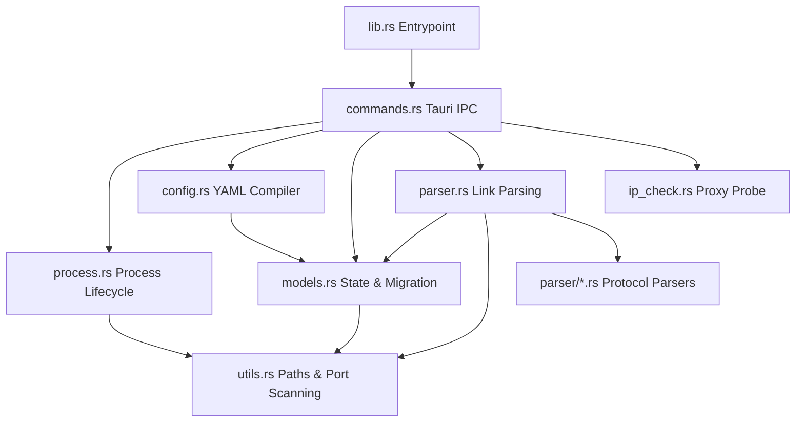

# mihomo-tools Project Notes & Architecture Guide

## Project Overview

`mihomo-tools` is a cross-platform (Windows & macOS) portable desktop GUI built with **Tauri 2 + React 19 + Rust** for managing a local **Mihomo (Clash.Meta) core**. The app enables users to create multiple local proxy entry points (inbounds) for fingerprint browsers, so each browser profile can connect to a different local inbound port and exit through a different upstream proxy (outbound).

### Primary Product Goals
- **Core Process Lifecycle**: Control a local Mihomo core binary (`mihomo.exe` on Windows, `mihomo` on macOS): start, stop, restart with hot-reload via the Mihomo RESTful API, and track current running/stopped states.
- **Multi-Proxy Inbound Rules**: Create multiple local proxy rules dynamically. For each rule, the app provisions one inbound listener (SOCKS5 / HTTP / Mixed), one matching outbound protocol configuration, and generates a dedicated Mihomo YAML configuration.
- **Multiple Outbound Protocols**: Supports **SOCKS5**, **Shadowsocks**, **VLESS** (TCP/WS, TLS, REALITY), **Trojan** (TCP/WS, TLS, REALITY), **AnyTLS**, and **Hysteria2** outbounds, designed to be easily extensible to others without rewriting persisted state.
- **Universal Clipboard Paste**: Parses and normalizes common proxy URLs (`socks5://`, `ss://`, `vless://`, `trojan://`, `anytls://`, `hy2://`) and Mihomo/Clash YAML node configs directly into structured rule outbound configs.
- **Portable & Installer-Free**: Runs portably next-to-exe with local `./data/` and `./mihomo/` workspaces; does not require installation or system app data directories.

---

## 1. Project Directory Layout

The project follows a clean decoupled design dividing system-level Rust operations from UI-level React components:

```text
mihomo-tools/
├── data/                       # Created portably at runtime next to the executable
│   ├── app-state.json          # Persistent user application state (rules, settings)
│   └── generated-config.yaml   # Dynamically compiled Mihomo YAML run configuration
├── mihomo/                     # Folder containing the Mihomo core binary
│   └── mihomo.exe              # Mihomo (Clash.Meta) core binary (or `mihomo` on macOS)
├── scripts/                    # Build & release automation scripts
│   ├── download-mihomo.js      # Auto-downloads latest Mihomo core from GitHub Releases
│   └── release.js              # Version bump, git tag, and push automation
├── .github/workflows/
│   └── release.yml             # CI/CD: parallel builds for Win x64 and macOS arm64
├── src-tauri/                  # Desktop Shell (Tauri 2 + Rust)
│   ├── src/
│   │   ├── main.rs             # Native entry point (delegates to mihomo_tools_lib::run)
│   │   ├── lib.rs              # Library entry point, module boundaries, Tauri run(), & tests
│   │   ├── models.rs           # Persistent data schemas, validations & schema migrations
│   │   ├── utils.rs            # Port checks, path builders, and encoding utils
│   │   ├── process.rs          # Process controls (Mihomo child lifecycle)
│   │   ├── config.rs           # Mihomo YAML configuration compiler
│   │   ├── ip_check.rs         # Proxy-routed GeoIP checking
│   │   ├── commands.rs         # Front-facing Tauri IPC command routing layer
│   │   ├── parser.rs           # URL/YAML parsing entry point & shared utilities
│   │   └── parser/             # Protocol-specific URL parsers (modularized)
│   │       ├── socks.rs        # SOCKS5 URL & raw format parser
│   │       ├── shadowsocks.rs  # Shadowsocks (ss://) URL parser
│   │       ├── vless.rs        # VLESS URL parser (TCP/WS, TLS, REALITY)
│   │       ├── trojan.rs       # Trojan URL parser (TCP/WS, TLS, REALITY)
│   │       ├── anytls.rs       # AnyTLS URL parser
│   │       ├── hysteria2.rs    # Hysteria2 URL parser
│   │       └── mihomo_yaml.rs  # Mihomo/Clash YAML node config parser
│   └── Cargo.toml
└── src/                        # UI Frontend (React 19 + TypeScript + Vite)
    ├── api/
    │   └── backend.ts          # Tauri invoke bindings for TypeScript
    ├── features/
    │   └── runtime/            # Runtime layout blocks & status cards
    ├── App.tsx                 # Main Dashboard, editor modal, & control panel
    ├── App.css                 # Advanced, premium dark-glassmorphism CSS stylesheet
    └── main.tsx                # React app mount entrypoint
```

---

## 2. Rust Backend Modular Architecture

The Rust codebase is modularized to support robust scaling and zero compile warnings:



### Module Description & Responsibilities

#### A. Entrypoint & Test Harness (`lib.rs`)
- Exposes modular boundaries (`pub mod`).
- Re-exports key public structures (`AppState`, `ProxyRule`, `InboundConfig`, `OutboundConfig`, protocol-specific configs, etc.) so that external scopes and integration tests do not break.
- Declares the Tauri `run()` entrypoint, registering `AppRuntimeState` and embedding all 25 system-level IPC command endpoints.
- Houses 26 integration and unit tests validating URL parser edge cases, config compilers, port conflict detection, schema migrations, and Clash YAML parsing.

#### B. Domain Models & Schema Migrations (`models.rs`)
- Represents the core structures, constants, and settings representing the application state.
- Employs a robust tagged `OutboundConfig` enum with 6 protocol variants: `Socks`, `Shadowsocks`, `Vless`, `Trojan`, `Anytls`, `Hysteria2`.
- Manages **Schema Version Migrations** (`SCHEMA_VERSION = 4`). Automatically migrates older configurations:
  - **V1** → V2: SOCKS-only flat outbound structure to tagged `OutboundConfig` enum.
  - **V2** → V4: Old `InboundProtocolV2` (socks/http) to new `InboundProtocol` (mixed/socks/http).
  - **V3** → V4: Multi-entity model (rules + groups + proxies) flattened into unified `ProxyRule` list.

#### C. Path & Port Utilities (`utils.rs`)
- Resolves `./data/` and `./mihomo/` directories relative to the currently running executable (`std::env::current_exe`).
- Implements port binding tests: checks port availability via TCP listeners and returns boolean status flags.
- Prevents conflicts by detecting overlapping ports before writing configurations.
- Provides encoding utilities (percent-decode) shared across parsers.

#### D. Core Process Lifecycle (`process.rs`)
- Encapsulates state within `AppRuntimeState`, holding a `Mutex<MihomoProcessManager>` and traffic tracking state (connection maps, speed calculations, poll timers).
- Manages child process creation: spawns `mihomo -d <data_dir> -f <config_path>` while managing stdout/stderr redirection to `mihomo.log`.
- On Windows, uses `CREATE_NO_WINDOW` creation flag to prevent console flashing.
- Safely terminates child processes on demand or during application exit (`tauri::RunEvent::Exit`).

#### E. Mihomo Config Compiler (`config.rs`)
- Compiles local rules into **Mihomo YAML** configurations (output as `generated-config.yaml`).
- Translates each enabled rule into:
  1. A `listeners` entry (type: socks/http/mixed; bind address; port; optional auth).
  2. A corresponding `proxies` entry with Mihomo-native fields for the chosen protocol.
  3. A `proxy-groups` entry mapping the listener to the proxy node for traffic isolation.
- Includes Mihomo external controller binding (`external-controller: 127.0.0.1:37896`) for hot-reload and stats querying.

#### F. Universal Clipboard Parser (`parser.rs` + `parser/*.rs`)
- Entry point `parse_outbound_url_value()` routes input through protocol-specific sub-parsers:
  - **SOCKS/SOCKS5** (`parser/socks.rs`): `socks5://[user:pass@]host:port` and 5 raw text formats (e.g., `host:port:user:pass`).
  - **Shadowsocks** (`parser/shadowsocks.rs`): Standard and base64-encoded userinfo formats.
  - **VLESS** (`parser/vless.rs`): Parses `security`, `type`, `sni`, `fp`, `pbk`, `sid`, `flow` parameters for TCP/WS, TLS, and REALITY.
  - **Trojan** (`parser/trojan.rs`): Parses `security`, `type`, `sni`, `fp`, `pbk`, `sid` parameters for TCP/WS, TLS, and REALITY.
  - **AnyTLS** (`parser/anytls.rs`): Parses `sni`, `skip-cert-verify`, `client-fingerprint`, `alpn`.
  - **Hysteria2** (`parser/hysteria2.rs`): Parses `sni`, `skip-cert-verify`, `tfo`, `up`, `down`, `obfs` with salamander support.
  - **Mihomo YAML** (`parser/mihomo_yaml.rs`): Parses Clash/Mihomo-format YAML node configs as a universal fallback.
- Includes URL normalization (`normalize_proxy_url`) that safely handles special characters in credentials.

#### G. IP Route Checker (`ip_check.rs`)
- Executes network requests to `https://ipinfo.io/json` *through* the rule's specific local inbound port proxy to check route health, speed, and country details.

#### H. Tauri IPC Command API (`commands.rs`)
Exposes 25 commands directly to React. Key API routes include:
- **State management**: `load_app_state()` / `save_app_state(state)` / `save_and_apply_app_state(state)`
- **Rule CRUD**: `add_rule(rule)` / `update_rule(rule)` / `duplicate_rule(id)` / `remove_rule(id)` / `set_rule_enabled(id, enabled)`
- **Process control**: `start_mihomo()` / `stop_mihomo()` / `restart_mihomo()`
- **IP checking**: `check_rule_ip(id)` / `check_rules_ip_batch(ids)`
- **Parsing**: `parse_outbound_url(input)` / `parse_socks_outbound_url(input)`
- **Config generation**: `generate_mihomo_config(state?)` / `write_mihomo_config(state?)`
- **Validation**: `validate_mihomo_binary()` / `get_mihomo_version()` / `check_port_available(port)` / `validate_rule_ports(state)`
- **Runtime**: `get_runtime_status()` / `get_runtime_paths()` / `query_mihomo_stats()`

---

## 3. Frontend Architecture & Design System

The React 19 interface implements a premium, high-tech glassmorphic aesthetic built purely on vanilla CSS variables:

### Styling & Aesthetics (`src/App.css`)
- **Theme Variables**: Curated harmonious colors tailored for high-contrast visibility (`--color-accent` cyan, `--color-accent-2` amber, and soft green/red indicators).
- **Glassmorphism panels**: Applies high-blur backdrops (`backdrop-filter: blur(1.25rem)`), subtle white border overlays, and custom grids overlaying radial gradient lighting.
- **Dynamic Animations**: Seamless micro-animations for card hovers, status dot glows, and toast message reveal steps.

### Entrypoints
- **`App.tsx`**: Renders the complete dashboard interface:
  - App state header (showing Mihomo status, core version, and runtime system settings).
  - Port statistics grid with real-time traffic monitoring.
  - Rules list, detailing active local listeners, connection routes, traffic statistics, and inline action controls.
  - Comprehensive Slide-Over editor modal for rule creation, port edits, custom inbound auth, and outbounds URL parsing.

---

## 4. Build & Release Pipeline

### Local Development
```bash
pnpm install              # Install frontend dependencies
pnpm run download-mihomo  # Auto-download latest Mihomo core binary
pnpm tauri dev            # Start dev mode (Vite HMR + Tauri)
```

### Release Workflow
1. Edit `version.txt` with the new SemVer version.
2. Run `pnpm run release` — auto-syncs `package.json` and `tauri.conf.json`, commits, tags, and pushes.
3. GitHub Actions CI (`.github/workflows/release.yml`) builds 2 platforms in parallel:
   - Windows x64 (`windows-latest`)
   - macOS arm64 (`macos-latest`)
4. Each job: downloads latest Mihomo core → builds Tauri app → packages portable `.zip` → uploads to GitHub Release.

---

## 5. Guidelines for Future AI Developers

When working on this repository, please adhere to the following strict practices:

### A. Extending Outbound Protocols
- Add the new protocol config struct to `models.rs` and register it as a new variant inside the `OutboundConfig` enum.
- Create a new parser file under `parser/` (e.g., `parser/vmess.rs`) and register it in `parser.rs` (`pub mod` + route in `parse_outbound_url_value`).
- Add corresponding URL parsing tests to `lib.rs` tests.
- Extend `config.rs` to generate the correct Mihomo YAML proxy block for the new protocol according to the [official Mihomo documentation](https://wiki.metacubex.one/).

### B. Path Handling & Portability
- **Do not write absolute paths** or OS-dependent app data paths (`C:\Users\...` or `AppData`).
- Always resolve paths relative to the current executable directory via the systems provided in `utils.rs`.

### C. Package Manager
- Always use **`pnpm`** exclusively for frontend dependencies. Do not run `npm` or `yarn` commands which would create conflict lockfiles.

### D. Styling & CSS Rules
- Do not introduce ad-hoc utility styling packages unless required. Custom layout controls, themes, and animations must be handled within the curated variables of `src/App.css`.

### E. Configuration Format
- Mihomo uses **YAML** configuration format (not JSON). The generated config file is `generated-config.yaml`.
- Use `serde_yaml` for serialization. Follow Mihomo field naming conventions (kebab-case in YAML output, e.g., `proxy-groups`, `skip-cert-verify`, `client-fingerprint`).

### F. Hot Reload
- When Mihomo is already running, configuration changes are applied via the Mihomo RESTful API (`PUT http://127.0.0.1:37896/configs?force=true`) for zero-downtime reload.
- If the hot-reload API call fails, the system falls back to a full process restart (stop + start).

### G. Code Integrity & Warnings
- Maintain strict type bounds. Avoid `as any` or suppression decorators (`@ts-ignore`).
- Keep the Rust compilation completely warning-free. Before proposing changes, run:
  ```powershell
  cargo check
  cargo test
  ```
  to verify that all 26 unit tests pass cleanly.
